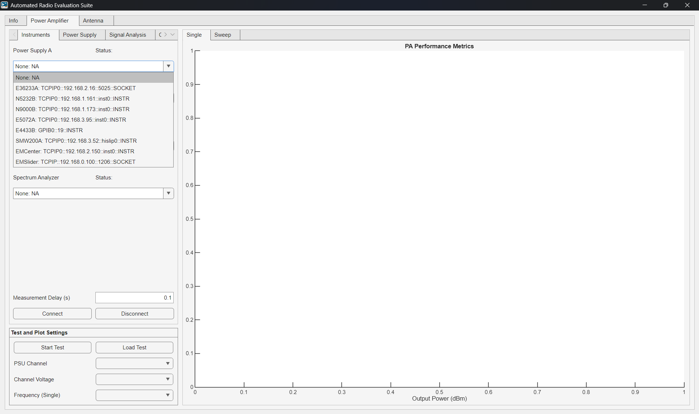
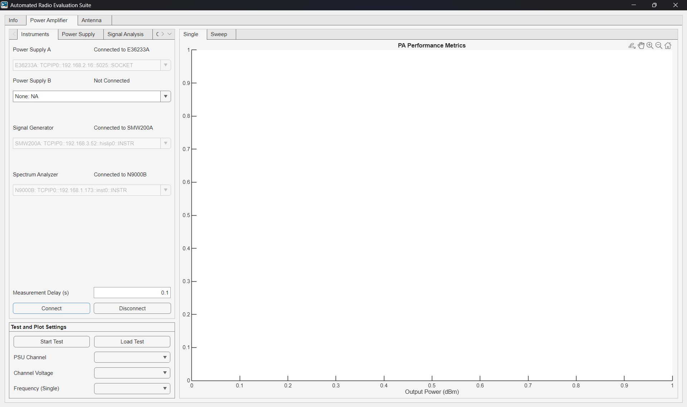
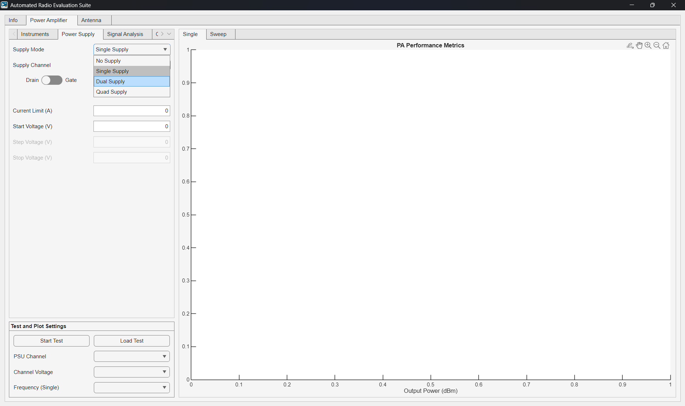
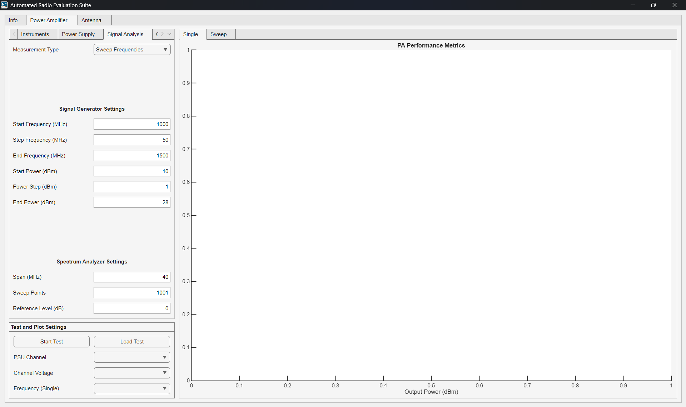
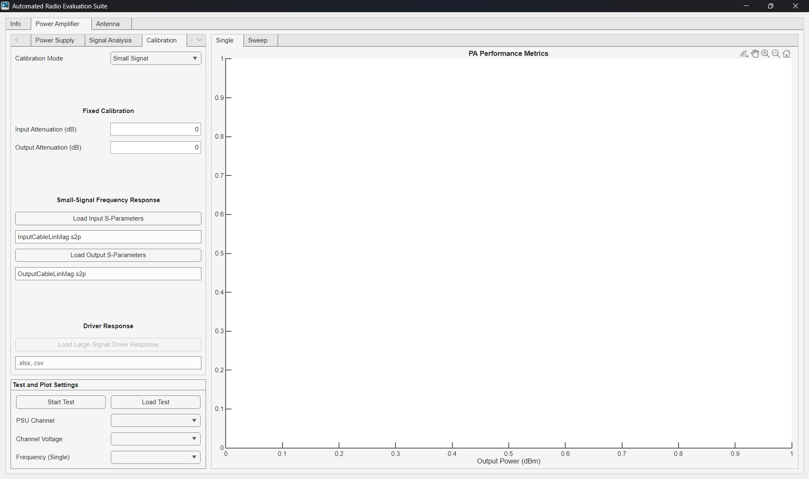

# PA Tutorial

Power Amplifier (PA) measurements can be performed with frequency, RF power, and controlling up to four power supplies. The program will capture the measurement, calculate figures of merit (FoM), save, and plot the results.

### 1. Connect to the instruments

  

  

### 2. Configure the DC power supplies

  

  

### 3. Configure the signal generator and analyzer

  

### 4. Configure the measurement calibration

  

### 4. Run the test and plot the results
Single Results View

  

Sweep Results View

  

